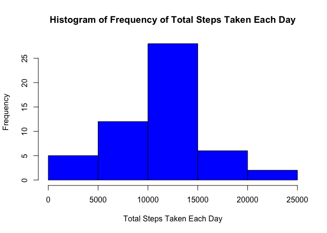
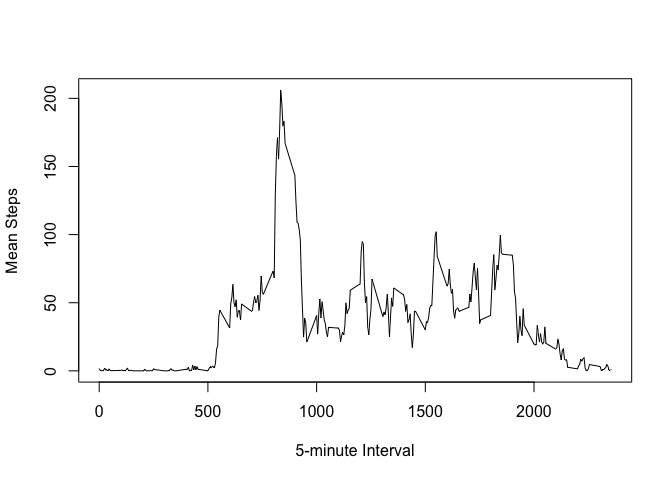
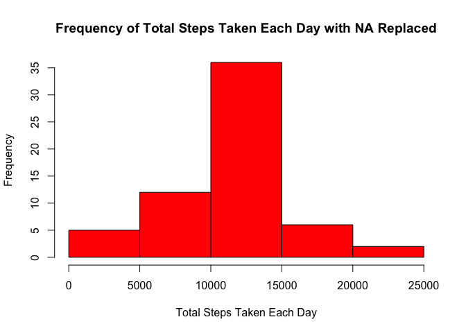
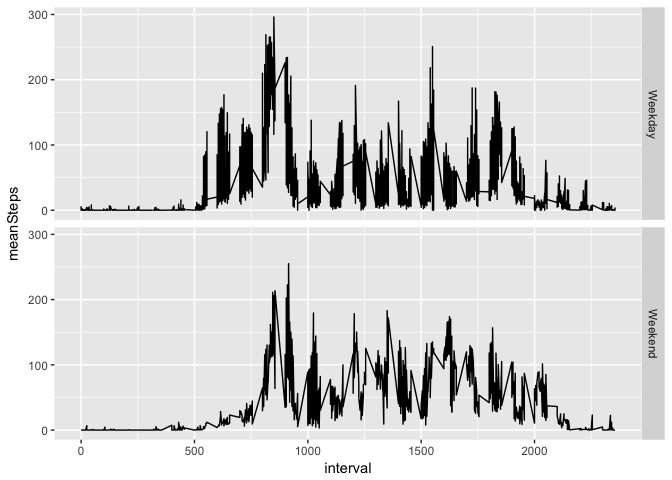

# Reproducible Research: Peer Assessment 1


## Loading and preprocessing the data

#### 1. Load the Data

```r
download.file("https://d396qusza40orc.cloudfront.net/repdata%2Fdata%2Factivity.zip", "repdata-data-activity.zip")
unzip("repdata-data-activity.zip")
activityData <- read.csv("activity.csv")
```

#### 2. Process/transform the data (if necessary) into a format suitable for your analysis

```r
library(lubridate)
```

```
## 
## Attaching package: 'lubridate'
```

```
## The following object is masked from 'package:base':
## 
##     date
```

```r
activityData$date <- ymd(activityData$date)
```

## What is mean total number of steps taken per day?  

#### 1. Calculate the total number of steps taken per day.  

```r
library(dplyr)
```

```
## 
## Attaching package: 'dplyr'
```

```
## The following objects are masked from 'package:lubridate':
## 
##     intersect, setdiff, union
```

```
## The following objects are masked from 'package:stats':
## 
##     filter, lag
```

```
## The following objects are masked from 'package:base':
## 
##     intersect, setdiff, setequal, union
```

```r
stepsPerDay <- activityData %>% group_by(date) %>% summarise(totalSteps = sum(steps))
```

#### 2. Make a histogram of the total number of steps taken each day.  

```r
hist(stepsPerDay$totalSteps,
     xlab = "Total Steps Taken Each Day",
     main = "Histogram of Frequency of Total Steps Taken Each Day",
     col = 4
     )
```

<!-- -->

#### 3. Calculate and report the mean and median of the total number of steps taken per day.  

```r
mmActivity <- activityData %>% group_by(date) %>% summarise_each(funs(median, mean))
mmActivity[,c(1,2,4)]
```

```
## # A tibble: 61 × 3
##          date steps_median steps_mean
##        <date>        <dbl>      <dbl>
## 1  2012-10-01           NA         NA
## 2  2012-10-02            0    0.43750
## 3  2012-10-03            0   39.41667
## 4  2012-10-04            0   42.06944
## 5  2012-10-05            0   46.15972
## 6  2012-10-06            0   53.54167
## 7  2012-10-07            0   38.24653
## 8  2012-10-08           NA         NA
## 9  2012-10-09            0   44.48264
## 10 2012-10-10            0   34.37500
## # ... with 51 more rows
```
## What is the average daily activity pattern?

#### 1. Make a time series plot (i.e. type = "l") of the 5-minute interval (x-axis) and the average number of steps taken, averaged across all days (y-axis)

```r
intervalData <- activityData %>% group_by(interval) %>% summarise(meanSteps = mean(steps, na.rm = TRUE))

plot( x = intervalData$interval, 
      y = intervalData$meanSteps, 
      type = "l",
      xlab = "5-minute Interval",
      ylab = "Mean Steps")
```

<!-- -->

#### 2. Which 5-minute interval, on average across all the days in the dataset, contains the maximum number of steps?

```r
intervalData[which (intervalData$meanSteps == max(intervalData$meanSteps)), ]
```

```
## # A tibble: 1 × 2
##   interval meanSteps
##      <int>     <dbl>
## 1      835  206.1698
```

Maximum number of average steps is 206 at interval 835.  

## Imputing missing values
Note that there are a number of days/intervals where there are missing values (coded as NA). The presence of missing days may introduce bias into some calculations or summaries of the data.

#### 1. Calculate and report the total number of missing values in the dataset (i.e. the total number of rows with NAs)

```r
## Sum all na values in steps
sum(is.na(activityData$steps))
```

```
## [1] 2304
```

#### 2. Devise a strategy for filling in all of the missing values in the dataset. The strategy does not need to be sophisticated. For example, you could use the mean/median for that day, or the mean for that 5-minute interval, etc.

#### 3. Create a new dataset that is equal to the original dataset but with the missing data filled in.

```r
## Group by interval and replace all NA steps with the mean for the interval overall
activityData2 <- activityData %>% group_by(interval) %>% 
    mutate(steps = ifelse(is.na(steps), as.integer(mean(steps, na.rm=TRUE)), steps))
```

#### 4. Make a histogram of the total number of steps taken each day and Calculate and report the mean and median total number of steps taken per day. Do these values differ from the estimates from the first part of the assignment? What is the impact of imputing missing data on the estimates of the total daily number of steps?

```r
## Regroup the new data by Date and sum the steps by date
stepsPerDay2 <- activityData2 %>% group_by(date) %>% summarise(totalSteps = sum(steps))

## Create histogram with the new data
hist(stepsPerDay2$totalSteps,
     xlab = "Total Steps Taken Each Day",
     main = "Frequency of Total Steps Taken Each Day with NA Replaced",
     col = 2
     )
```

<!-- -->

```r
## Calculate the new mean and median, and report them out
mmActivity2 <- activityData2 %>% group_by(date) %>% summarise_each(funs(median, mean))
mmActivity2[,c(1,2,4)]
```

```
## # A tibble: 61 × 3
##          date steps_median steps_mean
##        <date>        <dbl>      <dbl>
## 1  2012-10-01         33.5   36.94792
## 2  2012-10-02          0.0    0.43750
## 3  2012-10-03          0.0   39.41667
## 4  2012-10-04          0.0   42.06944
## 5  2012-10-05          0.0   46.15972
## 6  2012-10-06          0.0   53.54167
## 7  2012-10-07          0.0   38.24653
## 8  2012-10-08         33.5   36.94792
## 9  2012-10-09          0.0   44.48264
## 10 2012-10-10          0.0   34.37500
## # ... with 51 more rows
```

The values show a higher frequency, with the same range of steps taken each day. Modifying the data with the method I used fills in days which originally had NA (2017-10-1, 2017-10-8, etc.).

## Are there differences in activity patterns between weekdays and weekends?
#### 1. Create a new factor variable in the dataset with two levels -- "weekday" and "weekend" indicating whether a given date is a weekday or weekend day.


```r
activityData2$day <- wday(activityData2$date, label = TRUE)
intervalData2 <- activityData2 %>% group_by(interval, day) %>% summarise(meanSteps = mean(steps))
intervalData2 <- intervalData2 %>% mutate(wdID = ifelse((day == "Sat" | day == "Sun"), "Weekend", "Weekday"))
```


#### 2. Make a panel plot containing a time series plot (i.e. type = "l") of the 5-minute interval (x-axis) and the average number of steps taken, averaged across all weekday days or weekend days (y-axis). 

```r
library(ggplot2)
ggplot(intervalData2, aes(interval, meanSteps))+geom_line()+facet_grid(wdID~.)
```

<!-- -->
